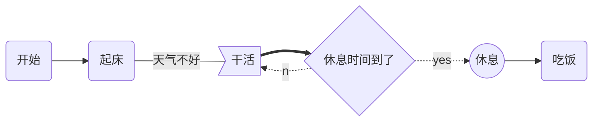
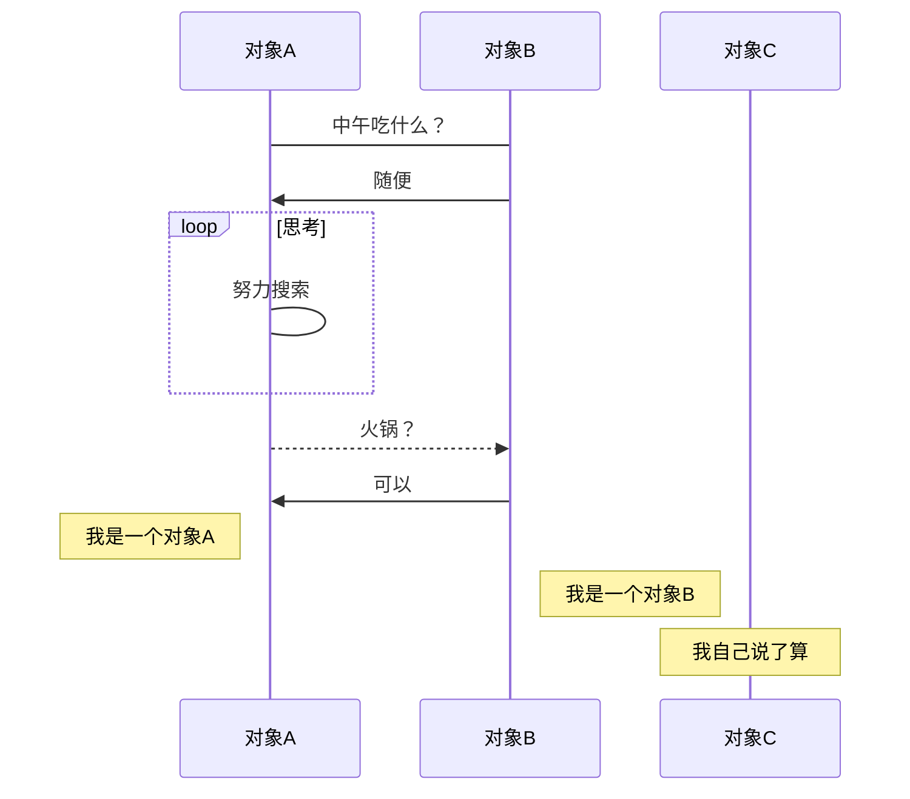
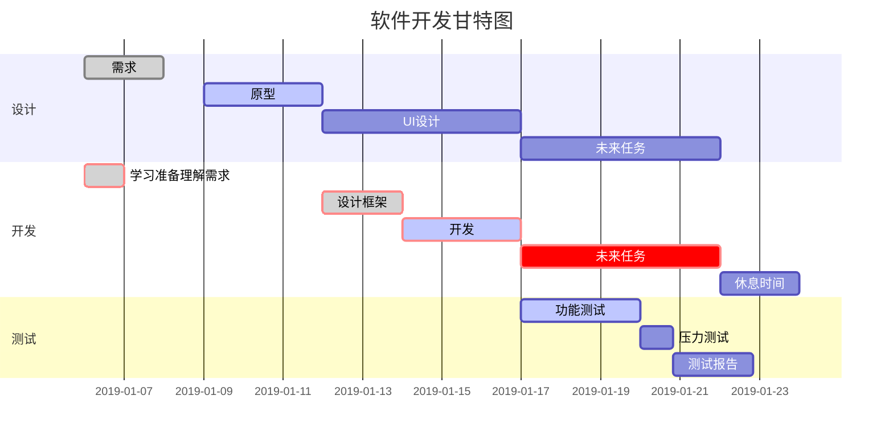

这些复杂图形的绘制都是使用代码块实现的，指定代码块的解析语言，按照响应的绘制语法即可实现。

+ 流程图——指定 `mermaid`（样式流程图） 或 `flow` （标准流程图）解析语言
+ 时序图——指定 `sequence`（标准时序图） 或 `mermaid`（样式时序图） 解析语言
+ 甘特图——指定 `mermaid` 解析语言

#### 一、流程图

##### 1. 样式流程图

基本语法：

+ `graph` 指定流程图方向：`graph LR` 横向，`graph TD` 纵向
+ 元素的形状定义：
  + `id[描述]` 以直角矩形绘制
  + `id(描述)` 以圆角矩形绘制
  + `id{描述}` 以菱形绘制
  + `id>描述]` 以不对称矩形绘制
  + `id((描述))` 以圆形绘制
+ 线条定义：
  + `A-->B` 带箭头指向
  + `A---B` 不带箭头连接
  + `A-.-B` 虚线连接
  + `A-.->B` 虚线指向
  + `A==>B` 加粗箭头指向
  + `A--描述---B` 不带箭头指向并在线段中间添加描述
  + `A--描述-->B` 带描述的箭头指向
  + `A-.描述.->B` 带描述的虚线连指向
  + `A==描述==>B` 带描述的加粗箭头指向
+ 子流程图定义：


```ruby
subgraph title
    graph direction
end
```

**示例：**



##### 2. 标准流程图

基本语法：

+ 定义模块 `id=>关键字: 描述` （“描述”的前面必须有空格，“=>” 两端不能有空格）
+ 关键字：
  + `start` 流程开始，以圆角矩形绘制
  + `opearation` 操作，以直角矩形绘制
  + `condition` 判断，以菱形绘制
  + `subroutine` 子流程，以左右带空白框的矩形绘制
  + `inputoutput` 输入输出，以平行四边形绘制
  + `end` 流程结束，以圆角矩形绘制
+ 定义模块间的流向：
  + `模块1 id->模块2 id` ：一般的箭头指向
  + `条件模块id (描述)->模块id(direction)` ：条件模块跳转到对应的执行模块，并指定对应分支的布局方向

**示例：**

```flow
st=>start: 开始
ipt=>inputoutput: 输入一个x
op=>operation: 处理加工x+1
cond=>condition: 溢出（是或否？）
sub=>subroutine: 子流程
io=>inputoutput: 输出x
ed=>end: 结束

st->ipt->op->cond
cond(yes)->io->ed
cond(no)->sub->io->ed
```

#### 二、 时序图

##### 1. 标准时序图

基本语法：

+ `Title:标题` ：指定时序图的标题
+ `Note direction of 对象:描述` ： 在对象的某一侧添加描述，`direction` 可以为 `right/left/over` ， `对象` 可以是多个对象，以 `,` 作为分隔符
+ `participant 对象` ：创建一个对象
+ `loop...end` ：创建一个循环体
+ `对象A->对象B:描述`： 绘制A与B之间的对话，以实线连接
  + `->` 实线实心箭头指向
  + `-->` 虚线实心箭头指向
  + `->>` 实线小箭头指向
  + `-->>` 虚线小箭头指向

**示例：**

```sequence
Title:时序图示例
客户端->服务端: 我想找你拿下数据 SYN
服务端-->客户端: 我收到你的请求啦 ACK+SYN
客户端->>服务端: 我收到你的确认啦，我们开始通信吧 ACK
Note right of 服务端: 我是一个服务端
Note left of 客户端: 我是一个客户端
Note over 服务端,客户端: TCP 三次握手
participant 观察者
```

##### 2. 带样式时序图

基本语法同标准时序图，不同的是

+ 需要使用 `mermaid` 解析，并在开头使用关键字 `sequenceDiagram` 指明
+ 线段的样式遵循 `mermaid` 的解析方式
  + `->` ： 实线连接
  + `-->` ：虚线连接
  + `->>` ：实线箭头指向
  + `-->>` ：虚线箭头指向

**示例：**




#### 三、甘特图

基本语法：

+ 使用 `mermaid` 解析语言，在开头使用关键字 `gantt` 指明
+ `deteFormat 格式` 指明日期的显示格式
+ `title 标题` 设置图标的标题
+ `section 描述` 定义纵向上的一个环节
+ 定义步骤：每个步骤有两种状态`done`（已完成）/ `active`（执行中）
  + `描述: 状态,id,开始日期,结束日期/持续时间`
  + `描述: 状态[,id],after id2,持续时间`
  + `crit` ：可用于标记该步骤需要被修正，将高亮显示
  + 如果不指定具体的开始时间或在某个步骤之后，将默认依次顺序排列

**示例：**

